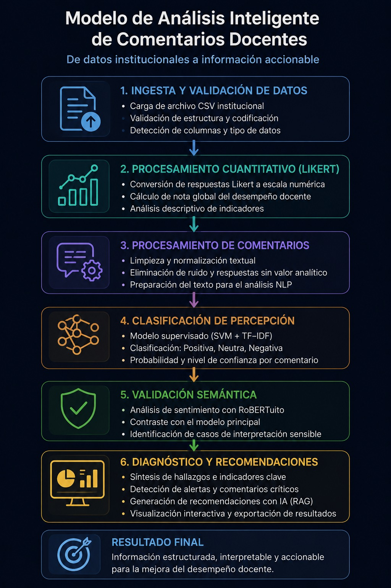
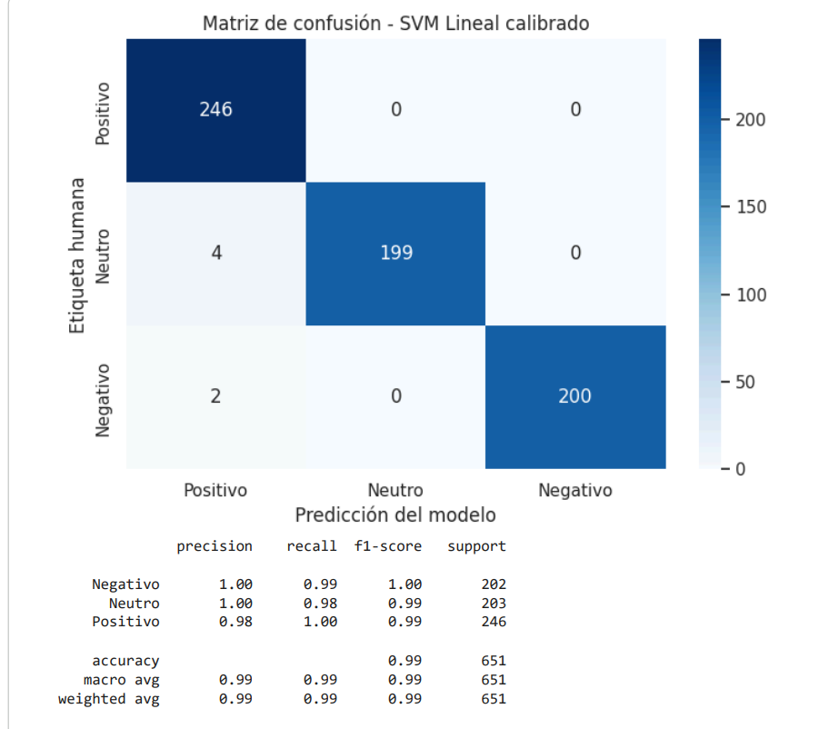
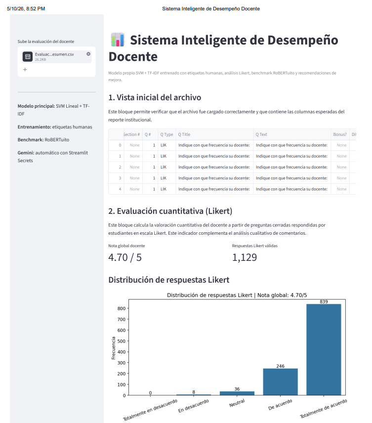

# Sistema Inteligente de Evaluación Docente

## 1. Descripción del proyecto

Este proyecto corresponde al desarrollo de un prototipo de inteligencia artificial para el análisis automatizado de evaluaciones docentes. El sistema procesa respuestas cuantitativas tipo Likert y comentarios abiertos de estudiantes, con el objetivo de identificar patrones de percepción, oportunidades de mejora pedagógica y señales de seguimiento académico.

El prototipo fue desarrollado como apoyo a procesos de evaluación docente, retroalimentación académica y toma de decisiones institucionales. No reemplaza el juicio humano ni constituye un mecanismo automático de sanción.

## 2. Problema abordado

Las evaluaciones docentes generan grandes volúmenes de información, especialmente comentarios abiertos escritos por estudiantes. Estos comentarios contienen señales importantes sobre claridad, metodología, retroalimentación, ritmo de clase, recursos y acompañamiento; sin embargo, su análisis manual puede ser lento, subjetivo y difícil de escalar.

Además, las calificaciones cuantitativas tipo Likert pueden mostrar una valoración general favorable, pero no siempre revelan oportunidades específicas de mejora. Por ello, se desarrolló un sistema que combina análisis cuantitativo y procesamiento de lenguaje natural.

## 3. Solución propuesta

Se desarrolló un sistema inteligente basado en:

- Análisis cuantitativo de respuestas Likert.
- Limpieza y depuración de comentarios abiertos.
- Modelo propio de clasificación de percepción estudiantil.
- Representación textual TF-IDF.
- Clasificador SVM Lineal calibrado entrenado con etiquetas humanas.
- Comparación externa con RoBERTuito como benchmark.
- Detección de temas pedagógicos accionables.
- Generación de recomendaciones con Gemini.
- Visualización interactiva mediante Streamlit.

## 4. Modelo final

El modelo principal del sistema es:

**SVM Lineal calibrado + TF-IDF**

Este modelo fue entrenado con comentarios etiquetados manualmente bajo tres categorías:

- Positivo
- Neutro
- Negativo

RoBERTuito no se utiliza como modelo principal, sino como benchmark externo para comparar el desempeño del modelo propio.

## 5. Datos utilizados

El proyecto utiliza una base consolidada de evaluaciones docentes que contiene:

- Respuestas cerradas tipo Likert.
- Comentarios abiertos de estudiantes.
- Etiquetas humanas para entrenamiento del modelo.
- Columnas institucionales como `Q Type`, `Answer`, `Answer Match` y `# Responses`.

Solo los comentarios con etiqueta humana válida fueron utilizados para el entrenamiento supervisado del modelo.

## 6. Pipeline del sistema

El flujo general del sistema es:

```text
Archivo CSV/XLSX
        ↓
Validación de columnas
        ↓
Separación de respuestas Likert y comentarios abiertos
        ↓
Limpieza y normalización textual
        ↓
Clasificación con modelo SVM + TF-IDF
        ↓
Comparación con RoBERTuito
        ↓
Detección de temas pedagógicos
        ↓
Diagnóstico interpretativo
        ↓
Recomendaciones con Gemini
        ↓
Descarga de resultados
```
## Arquitectura general del sistema



---


# 7. Modelos evaluados

Durante el desarrollo se compararon los siguientes modelos:
| Modelo               | Rol                            |
| -------------------- | ------------------------------ |
| Regresión Logística  | Modelo supervisado comparativo |
| Random Forest        | Modelo supervisado comparativo |
| SVM Lineal calibrado | Modelo final seleccionado      |
| RoBERTuito           | Benchmark externo              |

---

# 8. Resultados finales del modelo

El modelo final fue evaluado usando una partición de entrenamiento y prueba:

- 80% de los comentarios etiquetados para entrenamiento.
- 20% para prueba.

  En la prueba final, el modelo propio obtuvo 645 aciertos sobre 651 comentarios evaluados, mientras que RoBERTuito obtuvo 634 aciertos sobre el mismo conjunto de prueba.Estratificación por clase para conservar la distribución de Positivo, Neutro y Negativo.

Resultados principales:

| Modelo               | Accuracy | Precision Macro | Recall Macro | Macro F1 |
| -------------------- | -------: | --------------: | -----------: | -------: |
| SVM Lineal calibrado |   0.9908 |          0.9921 |       0.9901 |   0.9910 |
| Regresión Logística  |   0.9892 |          0.9908 |       0.9885 |   0.9895 |
| Random Forest        |   0.9892 |          0.9908 |       0.9885 |   0.9895 |
| RoBERTuito benchmark |   0.9739 |          0.9738 |       0.9758 |   0.9745 |

El mejor modelo propio fue SVM Lineal calibrado, por presentar el mayor Macro F1.

---

# 9. Evidencia de validación

El modelo final fue validado mediante:

- Métricas comparativas entre modelos.
- Matriz de confusión.
- Reporte de clasificación por clase.
- Comparación contra RoBERTuito.
- Pruebas funcionales en Streamlit.
- Descarga de resultados generados por el sistema.

En la prueba final, el modelo propio obtuvo 645 aciertos sobre 651 comentarios evaluados, mientras que RoBERTuito obtuvo 634 aciertos sobre el mismo conjunto de prueba.

## Matriz de confusión del modelo final



---

# 10. Funcionalidades del prototipo

La aplicación permite:

- Cargar archivos de evaluación docente.
- Calcular nota global Likert.
- Visualizar distribución de respuestas Likert.
- Limpiar comentarios sin valor analítico.
- Clasificar percepción estudiantil con el modelo SVM propio.
- Mostrar confianza del modelo SVM.
- Comparar resultados con RoBERTuito.
- Detectar temas pedagógicos de mejora.
- Identificar comentarios que requieren revisión.
- Generar diagnóstico interpretativo.
- Generar recomendaciones con Gemini.
- Descargar resultados en CSV.

## Dashboard del sistema



---

# 11. Tecnologías utilizadas

Python
Streamlit
Pandas
NumPy
Scikit-learn
NLTK
Matplotlib
Seaborn
Pysentimiento / RoBERTuito
Google Generative AI / Gemini
Joblib
FTFY

# 12. Requisitos técnicos

Para ejecutar el proyecto se requiere Python y las dependencias incluidas en el archivo:

requirements.txt

Las dependencias principales son:

streamlit
pandas
numpy
matplotlib
seaborn
scikit-learn
nltk
pysentimiento
transformers
torch
google-generativeai
ftfy
joblib

---

# 13. Instrucciones de ejecución local

1. Clonar el repositorio:
git clone URL_DEL_REPOSITORIO

2. Entrar a la carpeta del proyecto:
cd NOMBRE_DEL_REPOSITORIO

3. Instalar dependencias:
pip install -r requirements.txt

4. Ejecutar la aplicación:
streamlit run app.py

5. Subir un archivo CSV de evaluación docente desde la interfaz.

---

# 14. Configuración de Gemini en Streamlit

La API Key de Gemini no se solicita en pantalla. Debe configurarse en Streamlit Cloud mediante Secrets.

En Streamlit Cloud:
GEMINI_API_KEY = "TU_API_KEY"

Si Gemini no está configurado, la aplicación funciona igualmente, pero sin recomendaciones generativas automáticas.

---

# 15. Demo

La aplicación fue desplegada en Streamlit Cloud:
https://evaluaciondocentesapp.streamlit.app/

---

# 16. Organización recomendada del repositorio

.
├── app.py
├── requirements.txt
├── README.md
├── modelo_percepcion_docente_svm_etiqueta_manual.pkl
├── notebooks/
│   └── Modelo_Final_Colab_Etiquetas_Humanas_SVM_Calibrado.ipynb
├── resultados/
│   ├── comparacion_modelos_vs_etiqueta_manual.csv
│   ├── detalle_comparacion_modelo_propio_vs_robertuito.csv
│   └── temas_pedagogicos_detectados.csv
└── imagenes/
    ├── dashboard_streamlit.png
    ├── matriz_confusion.png
    ├── grafico_likert.png
    └── depuracion_comentarios.png

---

# 17. Mejoras incorporadas durante el desarrollo

Durante el desarrollo del proyecto se incorporaron las siguientes mejoras:
| Versión inicial                             | Mejora incorporada                                                 |
| ------------------------------------------- | ------------------------------------------------------------------ |
| Análisis básico de sentimiento              | Modelo propio SVM entrenado con etiquetas humanas                  |
| RoBERTuito como referencia principal        | RoBERTuito pasa a benchmark externo                                |
| Sin confianza del modelo propio             | SVM calibrado con `predict_proba`                                  |
| API Key visible en pantalla                 | Gemini configurado mediante Streamlit Secrets                      |
| Solo clasificación positivo/neutro/negativo | Detección de temas pedagógicos                                     |
| Sin gráfico Likert                          | Se agregó distribución Likert y nota global                        |
| Sin evidencia de limpieza                   | Se agregó gráfico de depuración de comentarios                     |
| Sin comparación formal                      | Se compararon Regresión Logística, Random Forest, SVM y RoBERTuito |
| Sin diagnóstico pedagógico estructurado     | Se agregó diagnóstico interpretativo y recomendaciones             |

---

# 18. Consideraciones éticas

El sistema no debe utilizarse como mecanismo automático de sanción o retiro docente. Sus resultados deben interpretarse como señales de apoyo para procesos de mejora, acompañamiento pedagógico y revisión académica.

Las percepciones estudiantiles pueden estar influenciadas por factores externos como dificultad de la asignatura, carga académica, preferencias personales o experiencias individuales. Por ello, los resultados deben ser revisados por responsables académicos antes de tomar decisiones de alto impacto.

---

# 19. Limitaciones

- El modelo depende de la calidad de las etiquetas humanas utilizadas para entrenamiento.
- Los comentarios pueden contener ambigüedad, ironía o subjetividad.
- El sistema clasifica percepción estudiantil, no desempeño docente absoluto.
- RoBERTuito se usa como benchmark, pero no reemplaza evaluación humana.
- El diagnóstico debe complementarse con observación docente, resultados académicos y criterios institucionales.

---

# 20. Estado final del prototipo

El prototipo se encuentra funcional, documentado y desplegado en Streamlit. Permite procesar evaluaciones docentes, clasificar percepción estudiantil, comparar con un benchmark externo, detectar temas pedagógicos y generar recomendaciones de mejora.
